# SentientShield Project Flows (Flowcharts)

This file collects the major runtime flows used in **SentientShield-ML-Detector**.

Primary entrypoints:
- FastAPI app: [main.py](file:///c:/Users/Dhruv/Documents/Projectss/SentientShield-ML-Detector/src/main.py)
- Command Center UI: [premium.html](file:///c:/Users/Dhruv/Documents/Projectss/SentientShield-ML-Detector/src/static/premium.html) + [app.js](file:///c:/Users/Dhruv/Documents/Projectss/SentientShield-ML-Detector/src/static/app.js)
- Streamlit dashboard: [streamlit_app.py](file:///c:/Users/Dhruv/Documents/Projectss/SentientShield-ML-Detector/src/streamlit_app.py)

---

## 1) High-level system architecture

```mermaid
flowchart LR
  U[User Browser] -->|HTTP| N[Nginx/Reverse proxy\n(optional)]
  U -->|HTTP| API[FastAPI (uvicorn)\nsrc.main:app]
  N -->|/| API
  N -->|/dashboard or /analytics| ST[Streamlit]

  API -->|serves| STATIC[Static UI\n/static/premium.html, app.js, styles.css]
  API --> ROUTERS[API Routers\n/api/* and /neuralfort/*]
  ST -->|fetch JSON| ROUTERS

  ROUTERS --> STORE[(SQLite/Postgres\nTrendStore/PGTrendStore)]
  ROUTERS --> INTEL[(SQLite\nlogs/intelligence.db)]
  ROUTERS --> FILELOG[(logs/api_calls.jsonl\nlogs/perf.jsonl)]
```

Code pointers:
- App wiring (routers, static): [main.py](file:///c:/Users/Dhruv/Documents/Projectss/SentientShield-ML-Detector/src/main.py)
- Nginx proxy (HF Spaces): [nginx.conf](file:///c:/Users/Dhruv/Documents/Projectss/SentientShield-ML-Detector/docker/nginx.conf)

---

## 2) Authentication flow (JWT)

All API routes using `Depends(auth_dependency)` require a `Bearer <token>` header.

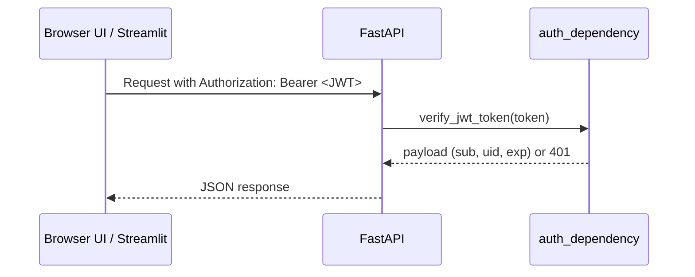

Code pointers:
- JWT verification: [security.py](file:///c:/Users/Dhruv/Documents/Projectss/SentientShield-ML-Detector/src/configs/security.py)
- Dev token generator: [status.py](file:///c:/Users/Dhruv/Documents/Projectss/SentientShield-ML-Detector/src/api/routers/status.py#L42-L52)

---

## 3) Command Center UI → API request flow

The Command Center is static HTML+JS and calls the API with fetch (see constants + `apiCall()` in `app.js`).

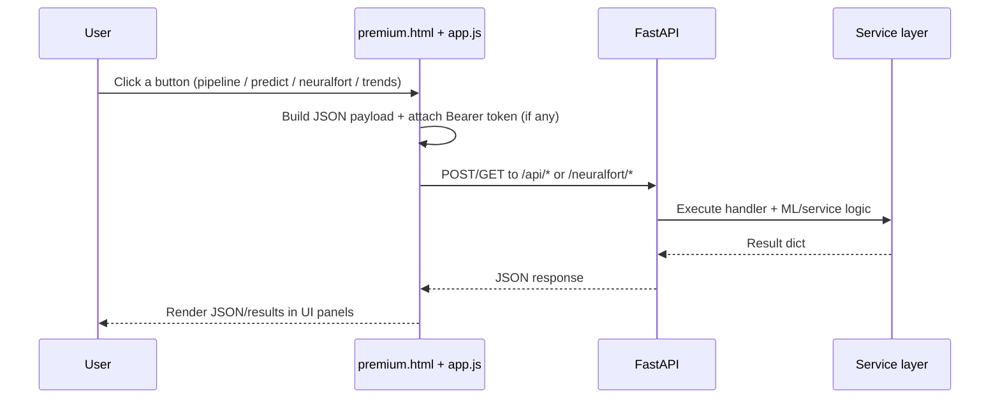

Code pointers:
- UI endpoints + handlers: [app.js](file:///c:/Users/Dhruv/Documents/Projectss/SentientShield-ML-Detector/src/static/app.js)
- Static UI markup: [premium.html](file:///c:/Users/Dhruv/Documents/Projectss/SentientShield-ML-Detector/src/static/premium.html)

---

## 4) Web-attack prediction flow (`POST /api/predict`)

This is the classical model prediction endpoint. If `raw_log` is included, it also triggers the intelligence pipeline.

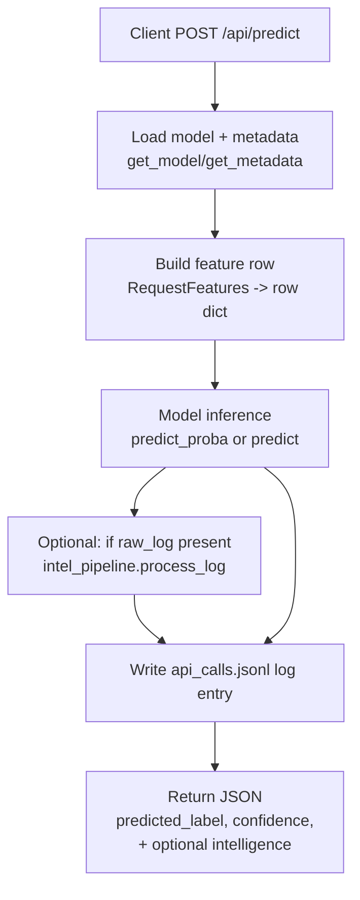

Code pointers:
- Endpoint: [predict.py](file:///c:/Users/Dhruv/Documents/Projectss/SentientShield-ML-Detector/src/api/routers/predict.py#L17-L89)
- Intelligence pipeline (SOC reports DB): [intel_service.py](file:///c:/Users/Dhruv/Documents/Projectss/SentientShield-ML-Detector/src/services/intel_service.py#L86-L178)
- Model loader: [loader.py](file:///c:/Users/Dhruv/Documents/Projectss/SentientShield-ML-Detector/src/models/loader.py)

---

## 5) Log triage pipeline flow (`POST /api/logs/pipeline/run`)

This is the “end-to-end log analysis” pipeline used by the Command Center and workflow runner.

```mermaid
flowchart TD
  A[Client POST /api/logs/pipeline/run] --> B[Lazy init pipeline context\n_get_ctx()]
  B --> C[Severity classification\nDistilBERTLogClassifier]
  C --> D[Threat type classification\nDistilBERTLogClassifier]
  D --> E[Embedding encode\nMiniLMEmbedder]
  E --> F[Optional ingest\nVectorIndex.add]
  F --> G[MITRE mapping + history\nMITREAttckMapper]
  G --> H[Risk score\nRiskScoringEngine]
  H --> I[Optional SOC report\nSOCReportGenerator]
  I --> J[Return JSON result]
```

Code pointers:
- Route: [logs.py](file:///c:/Users/Dhruv/Documents/Projectss/SentientShield-ML-Detector/src/api/routers/logs.py#L270-L298)
- Pipeline engine: [PipelineEngine.run](file:///c:/Users/Dhruv/Documents/Projectss/SentientShield-ML-Detector/src/services/log_service.py#L1315-L1347)
- Risk scoring: [RiskScoringEngine](file:///c:/Users/Dhruv/Documents/Projectss/SentientShield-ML-Detector/src/services/log_service.py#L1246-L1313)

---

## 6) Event storage + analytics trends flow

Recorded events are stored by the backend and later aggregated for charts.

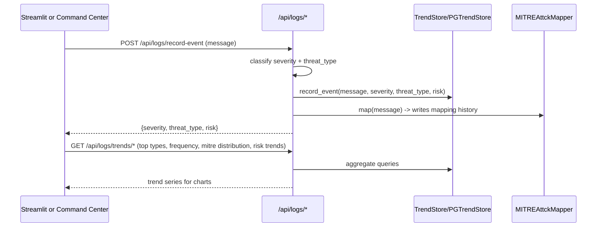

Code pointers:
- Logs routes: [logs.py](file:///c:/Users/Dhruv/Documents/Projectss/SentientShield-ML-Detector/src/api/routers/logs.py)
- SQLite store + trend queries: [TrendStore](file:///c:/Users/Dhruv/Documents/Projectss/SentientShield-ML-Detector/src/services/log_service.py#L661-L985)

---

## 7) Streamlit Threat Analytics dashboard flow

Streamlit is a “client” of the API: it fetches JSON from backend endpoints and renders charts/tables.

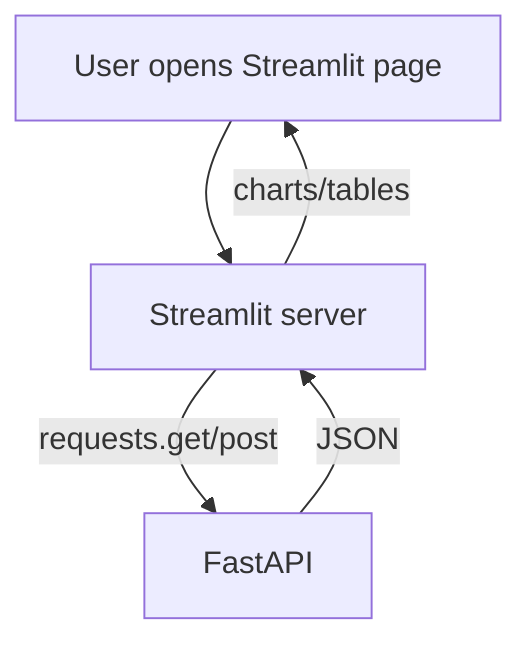

Code pointers:
- Streamlit API client helpers: [streamlit_app.py](file:///c:/Users/Dhruv/Documents/Projectss/SentientShield-ML-Detector/src/streamlit_app.py#L1-L60)

---

## 8) Dashboard realtime websocket “heartbeat” flow

The `/api/ws/realtime` websocket broadcasts a periodic heartbeat message.

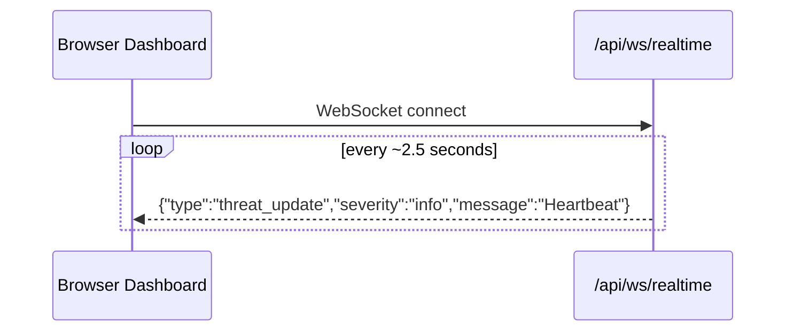

Code pointers:
- Websocket endpoint + simulator loop: [dashboard.py](file:///c:/Users/Dhruv/Documents/Projectss/SentientShield-ML-Detector/src/api/routers/dashboard.py#L28-L74)

---

## 9) NeuralFort flows

NeuralFort provides “website analysis” and “resilience framework” endpoints.

### 9.1 Website analysis flow (`POST /neuralfort/analyze-website`)

```mermaid
flowchart TD
  A[Client POST /neuralfort/analyze-website] --> B[perform_advanced_website_analysis]
  B --> C[Score + grade + categorize threats]
  C --> D[Generate recommendations + risk level + ml confidence]
  D --> E[Write API log entry (jsonl)]
  E --> F[Return analysis JSON]
```

Code pointers:
- Endpoint: [neuralfort.py router](file:///c:/Users/Dhruv/Documents/Projectss/SentientShield-ML-Detector/src/api/routers/neuralfort.py)
- Analysis helpers: [website_analysis.py](file:///c:/Users/Dhruv/Documents/Projectss/SentientShield-ML-Detector/src/services/website_analysis.py)

### 9.2 Resilience framework lifecycle (activation → monitoring → anomalies → healing)

```mermaid
flowchart TD
  A[Register/activate website] --> B[get_neuralfort_framework()]
  B --> C[Collect SystemMetrics]
  C --> D[Anomaly detector updates history]
  D --> E[Healing engine suggests/executes actions]
  E --> F[Expose via /neuralfort/anomalies and /neuralfort/healing-actions]
```

Code pointers:
- Framework: [neuralfort.py service](file:///c:/Users/Dhruv/Documents/Projectss/SentientShield-ML-Detector/src/services/neuralfort.py)
- Endpoints: [neuralfort.py router](file:///c:/Users/Dhruv/Documents/Projectss/SentientShield-ML-Detector/src/api/routers/neuralfort.py)

---

## 10) Batch log processing workflow (Render or local)

Trigger endpoint chooses Render Workflows (if `RENDER=true`) or local synchronous processing.

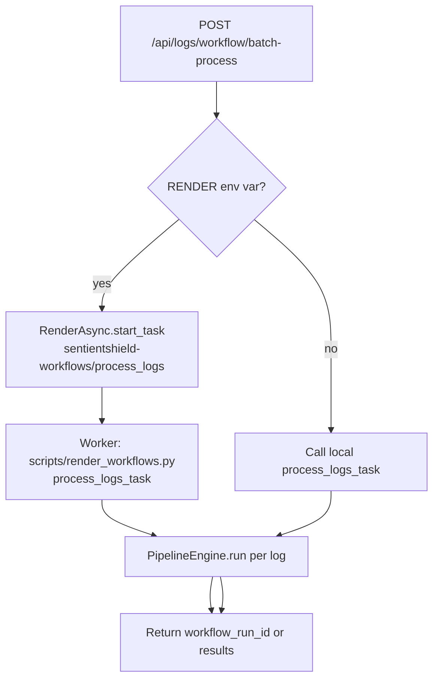

Code pointers:
- Trigger endpoint: [logs.py](file:///c:/Users/Dhruv/Documents/Projectss/SentientShield-ML-Detector/src/api/routers/logs.py#L256-L298)
- Worker task runner: [render_workflows.py](file:///c:/Users/Dhruv/Documents/Projectss/SentientShield-ML-Detector/scripts/render_workflows.py)

---

## 11) Scheduled retraining flow (background loop)

The app starts a background asyncio loop which calls `scripts.retrain.daily_retrain()` at a configured interval.

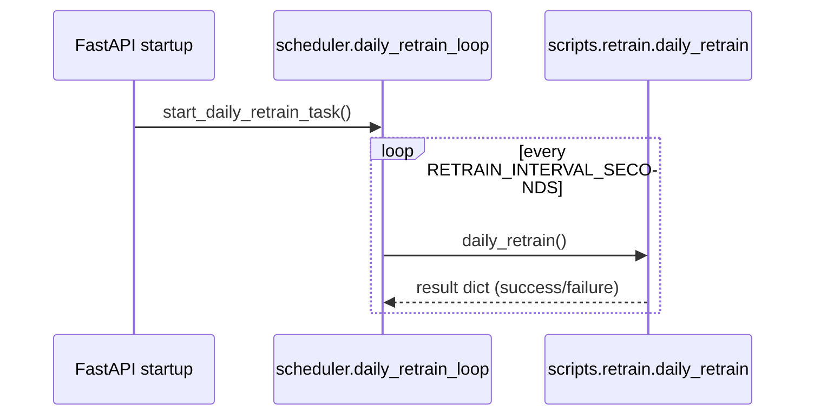

Code pointers:
- Scheduler: [scheduler.py](file:///c:/Users/Dhruv/Documents/Projectss/SentientShield-ML-Detector/src/api/tasks/scheduler.py)
- Startup wiring: [main.py](file:///c:/Users/Dhruv/Documents/Projectss/SentientShield-ML-Detector/src/main.py)
- Retrain implementation: [retrain.py](file:///c:/Users/Dhruv/Documents/Projectss/SentientShield-ML-Detector/scripts/retrain.py)

---

## 12) Deployment/runtime flows

### 12.1 Docker Compose (two services)

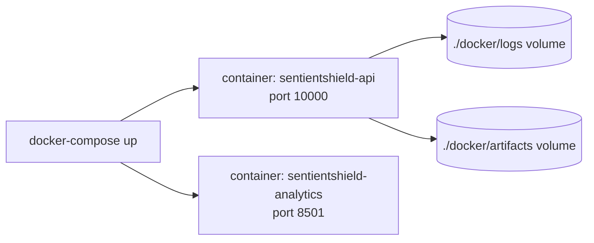

Code pointers:
- Compose file: [docker-compose.yml](file:///c:/Users/Dhruv/Documents/Projectss/SentientShield-ML-Detector/docker/docker-compose.yml)

### 12.2 HF Spaces Docker (single public port via Nginx)

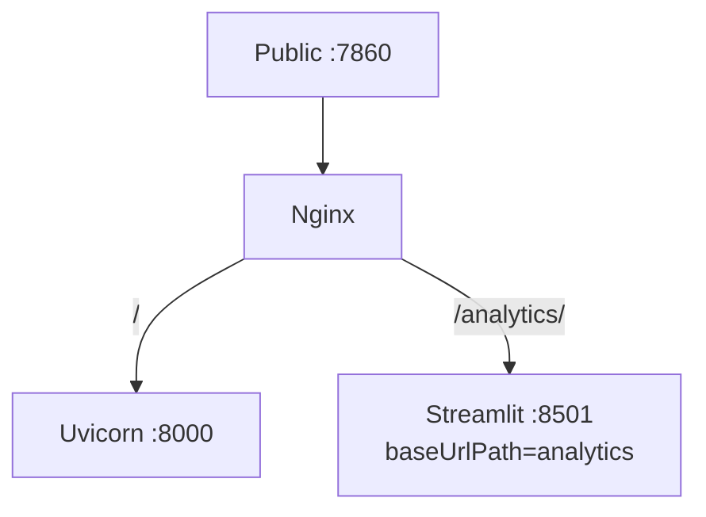

Code pointers:
- Startup script: [start.sh](file:///c:/Users/Dhruv/Documents/Projectss/SentientShield-ML-Detector/docker/start.sh)
- Proxy config: [nginx.conf](file:///c:/Users/Dhruv/Documents/Projectss/SentientShield-ML-Detector/docker/nginx.conf)

### 12.3 Cloudflare Tunnel (quick live demo)

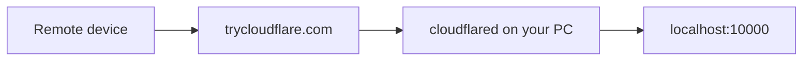

### 12.4 Cloudflare Tunnel (named tunnel, “permanent” hostnames)

For stable hostnames on your own domain (and optionally automatic start via Windows Service / Docker restart policies), use a **named tunnel**.

```mermaid
flowchart LR
  U[Remote device] --> CF[Cloudflare DNS + Tunnel]
  CF --> C[cloudflared (service/container)]
  C --> API[FastAPI :10000]
  C --> ST[Streamlit :8501]
```

Guide:
- [CLOUDFLARE_TUNNEL.md](file:///c:/Users/Dhruv/Documents/Projectss/SentientShield-ML-Detector/docs/CLOUDFLARE_TUNNEL.md)
